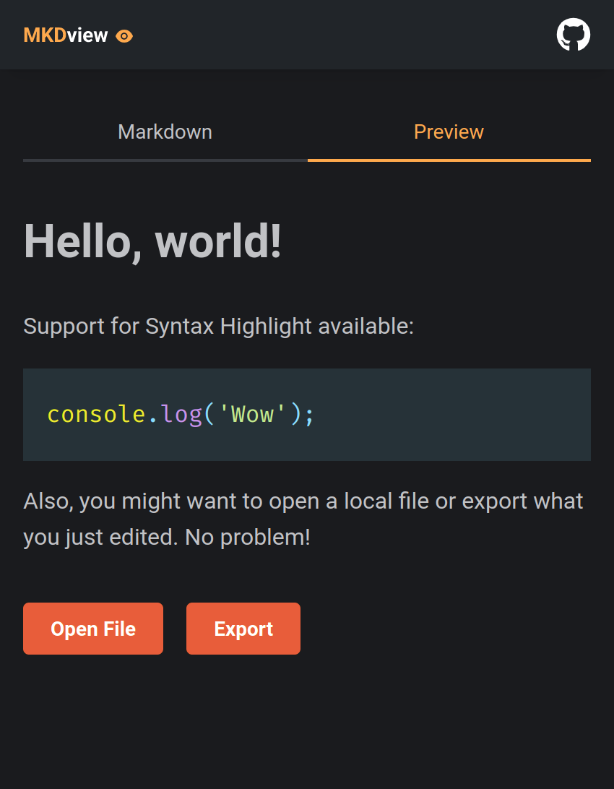

# MKDview

---

## 📕 About

MKDview is a simple Markdown viewer built with NextJS.

---

## ⚒️ Used Technologies

To develop this app, I used these technologies:

- NextJS (Create Next App)
- Typescript
- Mantine (Component Lib)
- React Markdown

---

## ✨ Features

- Responsivity
- Visualization of Markdown
- Support for Github's Markdown flavor
- Support for Syntax Highlight on Markdown preview

---

## ⚙️ How to Use

First, clone the repository.

Inside the project folder, run `yarn` or `yarn install` to install the dependencies.

Then, run `yarn dev` to start a local development server.

---

## 🤝 Be a Contributor

Have any idea that can help boost the project, and want to share it? It's simple!

1. Fork the project
2. Modify what you want
3. Commit the changes
4. Open a Pull Request

---

## 🔓 License

This project is under license. Click [here](./LICENSE.md) for details.
